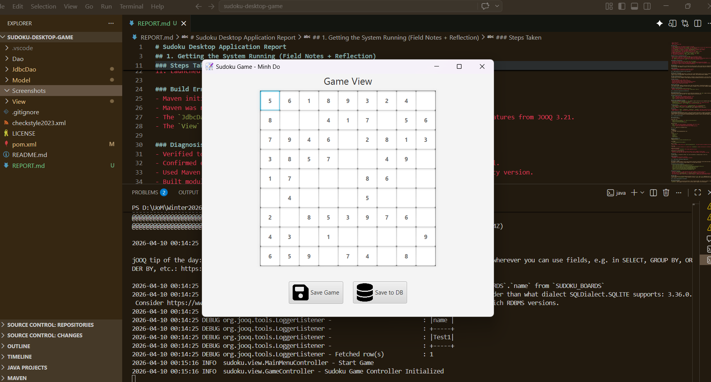
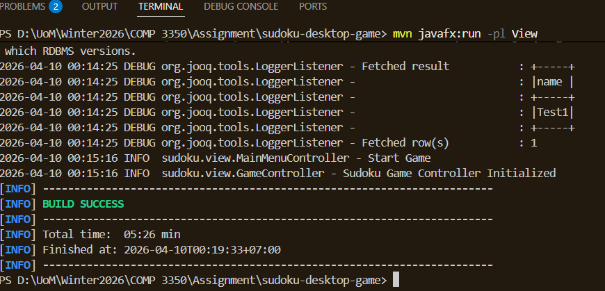
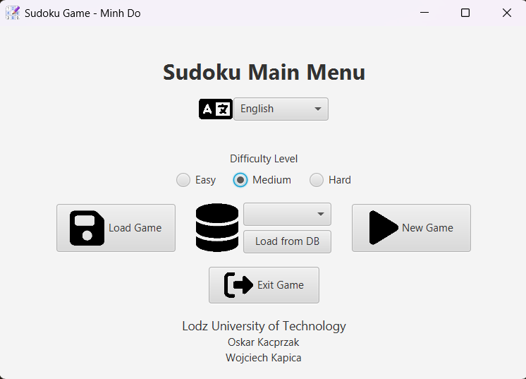
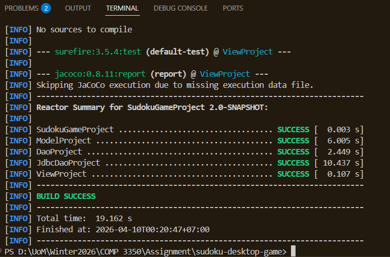

# Maintaining a Legacy System - Sudoku Desktop

## 1. Getting the System Running (Field Notes + Reflection)

### Environment Used
- OS: Windows 11
- Java: JDK 21.0.9
- Maven: 3.9.14
- IDE: Visual Studio Code

### Steps Taken
1. Cloned the repository and opened the project in VS Code.
2. Read `README.md` and the top-level `pom.xml` to understand the project structure and required tools.
3. Checked installed tools with `java -version` and `mvn -version`.
4. Installed JDK 21 and Maven 3.9.14 since the project requires Java 21+ and Maven 3.9+.
5. Set `JAVA_HOME` to `D:\jdk-21` and added `%JAVA_HOME%\bin` and Maven `bin` to PATH.
6. Restarted terminal to ensure environment changes took effect.
7. Ran `mvn clean install` and identified build issues in the `JdbcDao` module.
8. Updated JOOQ version in the root `pom.xml` from 3.19.9 to 3.21.0.
9. Regenerated JOOQ sources with `mvn clean generate-sources -pl JdbcDao`.
10. Built modules incrementally: `Model`, `Dao`, `JdbcDao`, then `View`.
11. Launched the application with `mvn javafx:run -pl View`.

### Build Errors or Configuration Issues

- Maven initially used Java 17 because `JAVA_HOME` was not pointing to JDK 21, so I updated the environment variable and restarted the terminal.
- Maven was not on PATH until I installed it and updated environment variables.
- The `JdbcDao` module would not build at first: the generated code required JOOQ 3.21, but the project was using 3.19.9. I found this by reading the Maven error output, then opened the root `pom.xml` and changed the JOOQ version to 3.21.0 under the `<dependencyManagement>` section. After saving, I ran `mvn clean generate-sources -pl JdbcDao` to regenerate the code.
- The `View` module could not run until the `JdbcDao` module was built, because it depends on the database code. I built the modules in order: first `Model`, then `Dao`, then `JdbcDao`, and finally `View`, using `mvn clean install -pl <module>` for each. This satisfied the dependencies between modules and allowed the app to launch.

### Diagnosis and Resolution

- Verified tool versions with `java -version` and `mvn -version`.
- Confirmed environment variable issues by checking `JAVA_HOME` and restarting the terminal.
- When I saw the JOOQ version error, I searched for the version in the root `pom.xml`, updated it, and regenerated sources for `JdbcDao`.
- To resolve module dependency issues, I built each module in dependency order using Maven, so that each module's output was available for the next.

### Reflection

My overall approach was a mix of trial-and-error and systematic investigation. I started by reading the README and pom.xml files to understand the project structure and requirements. When I hit build errors, I carefully read the Maven error messages, then searched the build files and source code for the relevant settings or dependencies. I explored the package structure in VS Code to find entry points and see how modules depended on each other. What worked best was following the dependency chain and fixing issues one at a time, rather than trying to build everything at once. I learned that the codebase is highly modular, but the modules are tightly coupled by their build order and dependency versions. The most challenging part was resolving version mismatches and understanding how changes in one module affected others. This process taught me the importance of reading error messages closely, checking build files, and building incrementally to isolate problems.

#### Screenshots showing application successfully built and ran




## 2. Understanding the System (In Your Own Words)

### What the Project Does
This project is a desktop Sudoku game. It allows users to play Sudoku puzzles on a PC using a JavaFX graphical interface. The app supports saving and loading games, choosing difficulty levels, and switching between languages.

### What Problem It Solves
It solves the problem of playing Sudoku digitally. Instead of using printed puzzles, a user can start a game, save progress, and continue later. It also provides a richer experience through selectable difficulty and persistent storage.

### Major Features
- Difficulty selection: easy, medium, hard.
- Save and load game progress to file or database.
- Internationalization: English and Polish UI resource bundles.
- JavaFX user interface with a main menu and game board.
- Database support through SQLite and JOOQ.

### User Interaction
A user opens the app, chooses a difficulty level, and clicks "New Game." The game board appears as a 9x9 grid. Users enter numbers into cells and can save or load games from the file system or database. The UI also allows changing language and selecting saved boards.

### Name-in-UI Modification
- Updated `View/src/main/java/sudoku/view/App.java`.
- Modified the window title to include my name: `Sudoku Game - Minh Do`.



## 3. Architecture Exploration and Reflection

### Architectural Style
The project follows a layered architecture with an MVC-style separation. The `Model` module contains game logic, the `Dao`/`JdbcDao` modules handle persistence, and the `View` module contains UI and controllers.

### Responsibility Division
- `Model`: game state, rules, validation, and solver logic.
- `Dao`: file-based persistence and DAO interfaces.
- `JdbcDao`: database persistence using SQLite and JOOQ.
- `View`: JavaFX UI, controllers, and user interaction.

### Separation Between UI and Logic
There is clear separation. UI classes in `View` depend on model classes but do not implement game logic themselves. For example:
- `GameController` uses `SudokuBoard` from `Model`.
- `MainMenuController` uses `FileSudokuBoardDao` and `JdbcSudokuBoardDao` for loading and saving.
- `BacktrackingSudokuSolver` lives in `Model` and is not part of the UI layer.

### High Coupling
- `MainMenuController` depends directly on `JdbcSudokuBoardDao` and `FileSudokuBoardDao`.
- `View` depends on `Model` classes like `SudokuBoard` and on DAO implementations.
This means changes in `SudokuBoard` or DAO APIs may require updates in the UI controllers.

### Cohesion
- Strong cohesion in `Model`: `SudokuBoard`, `SudokuField`, `SudokuRow`, and solver classes are all focused on puzzle logic.
- Weaker cohesion in `View`: controllers handle UI events, data loading, and some game state, which mixes responsibilities.

### Maintenance Reflection

While the modular structure helps organize the code, maintaining this system is challenging due to the tight coupling between UI controllers and persistence/model classes. Any change to the data model or DAO interfaces can require updates in multiple places, especially in the UI layer. The lack of abstraction (such as dependency injection or clear interfaces) means that swapping out persistence strategies or refactoring the model is risky and time-consuming. Without automated UI tests, regressions in the view layer are hard to catch. Overall, the architecture increases maintenance effort and risk, especially as requirements evolve or new features are added.

## 4. Testing and Build State

### Existing Tests
Yes, tests are present.

Where they live:
- `Model/src/test/java/models/` and `Model/src/test/java/helpers/`
- `Dao/src/test/java/sudoku/dao/`
- `JdbcDao/src/test/java/sudoku/jdbcdao/`

What they test:

- `Model` tests are mostly unit tests: they cover board validation, field behavior, and solver logic in isolation from external systems.
- `Dao` tests are primarily unit tests for file persistence and factory behavior, but may include some integration aspects if they interact with the filesystem.
- `JdbcDao` tests are integration tests, as they cover database persistence and storage operations using SQLite and JOOQ.

The `View` module has no automated tests.

### Test Run
Executed:
```powershell
mvn test
```


### Coverage
JaCoCo coverage results for all modules:
- **Model:** 90% instructions, 86% branches (core logic is very well tested)
- **Dao:** 41% instructions, 0% branches (low coverage, especially in factories and exceptions)
- **JdbcDao:** 41% instructions, 57% branches (core logic 78–81%, but generated code and some packages much lower)
- **View:** No coverage report found (likely no tests)

**How I ran and read coverage:**
As part of onboarding, I checked the Maven build files and noticed the JaCoCo plugin was configured. I ran `mvn clean test jacoco:report` in the project root, which generated coverage reports for each module under `target/site/jacoco/index.html`. I opened these HTML files in my browser to review coverage percentages and identify which packages and classes were well tested or needed more tests. This helped me understand the test quality and risk areas in the codebase.

**Comment:**
The Model module’s high coverage means puzzle logic and helpers are well tested, reducing risk for changes. Dao and JdbcDao have much lower coverage, especially in factories, exceptions, and generated code, these areas are riskier and would benefit from more tests. The View module has no coverage, reflecting the absence of UI tests. Overall, the core logic is robust, but persistence and UI layers are less protected by tests.


### New Automated Test
Added one test in:
- `Model/src/test/java/models/SudokuBoardTest.java`

Test added:
- `testCheckEndGameAfterSolvingBoard`

What it tests:
- After solving a Sudoku board with `BacktrackingSudokuSolver`, the board should be complete and valid.

Test type:
- Unit test. It verifies behavior of a single class (`SudokuBoard`) without involving UI or external persistence.

Refactoring required:
- None. The existing `SudokuBoard` API already supported the test.

Implications for maintainability:
- Presence of tests for model and persistence reduces risk for changes in those layers.
- Lack of UI tests means the view layer is still risky and would benefit from additional coverage.

  

## 5. Identifying a Maintenance Opportunity

### Design Flaw: Tight Coupling in UI Layer

**Describe the problem/change clearly:**
The UI controllers (e.g., `MainMenuController`, `GameController`) directly instantiate and depend on concrete DAO and model classes. This tight coupling makes the system fragile: any change to the data model or persistence layer can require changes in multiple UI classes. It also makes it difficult to add new storage backends or refactor persistence logic.

**Identify which classes/modules would be affected (include file names):**
- `View/src/main/java/sudoku/view/MainMenuController.java`
- `View/src/main/java/sudoku/view/GameController.java`
- `View/src/main/java/sudoku/view/strategies/SaveSudokuBoardToDatabaseStrategy.java`
- `Dao/src/main/java/sudoku/dao/models/FileSudokuBoardDao.java`
- `JdbcDao/src/main/java/sudoku/jdbcdao/JdbcSudokuBoardDao.java`

**Explain architectural risk:**
- Changes to the `SudokuBoard` or DAO interfaces can break multiple controllers at once.
- The lack of abstraction means swapping persistence strategies or adding new ones is risky and error-prone.
- The absence of automated UI tests means regressions are likely to go undetected.

**Describe where you would introduce a seam to safely modify the system:**
The seam should be at the existing `Dao<T>` interface in `Dao/src/main/java/sudoku/dao/interfaces/Dao.java`. UI controllers should depend only on this interface, not on concrete DAO classes. Use a factory or dependency injection to provide the correct DAO implementation. This approach enables easier testing (using mocks) and safer future changes to persistence logic.

## 6. Overall Maintainability Assessment

### Does the system appear actively maintained?
No. The latest commit is from 2024-06-23 (`a65fe49`), and there is no evidence of recent or ongoing development (see `git log -1 --pretty=format:'%h %ad %s' --date=short`). This lack of activity increases the risk of outdated dependencies and makes onboarding harder, as there may be unresolved issues or missing documentation. From a maintainability perspective, active maintenance is crucial for addressing bugs, updating libraries, and responding to user needs.

### Is technical debt visible? What evidence suggests that?
Yes, technical debt is clearly present. Hard-coded file paths in UI controllers (see `MainMenuController.java`) violate the principle of configuration over convention and make the system less flexible. The use of reflection in `DaoFactory` (see `Dao/src/main/java/sudoku/dao/factories/SudokuBoardDaoFactory.java`) introduces hidden dependencies and runtime errors, which are classic signs of technical debt. Tight coupling between UI and persistence layers (see direct DAO construction in `MainMenuController.java`, `GameController.java`) makes the codebase fragile and hard to refactor. The lack of automated tests for the `View` module (see absence of tests in `View/src/test/java`) means regressions are likely to go undetected. These issues all connect to course concepts of maintainability, testability, and the cost of technical debt over time.

### Are SOLID principles respected or violated? Provide examples.
- **Single Responsibility**: Violated in UI controllers, which handle UI, persistence, and navigation logic (see `MainMenuController.java`). This makes the code harder to test and maintain, as changes in one responsibility can affect others.
- **Open/Closed**: Partially respected in the DAO layer, but not in the UI layer—adding new persistence requires controller changes (see `MainMenuController.java`, `GameController.java`). This limits extensibility and violates the open/closed principle from the course.
- **Liskov Substitution**: Generally respected in model and DAO interfaces, supporting safe polymorphism and substitutability.
- **Interface Segregation**: Not fully respected; controllers depend on large, unfocused interfaces (see controller code structure), which increases cognitive load and risk of misuse.
- **Dependency Inversion**: Violated in the UI layer; controllers depend on concrete DAOs (see direct instantiation in `MainMenuController.java`). This makes the system less modular and harder to test, as discussed in the course.

### How difficult would it be to extend this system long-term?
It would be moderately difficult. The model and DAO layers are somewhat extensible due to modularity and tests, reflecting good separation of concerns. However, the UI and persistence layers are tightly coupled and lack test coverage, which increases the risk of breaking changes and slows down development. Adding new features or storage backends would require careful refactoring and risk breaking existing functionality (e.g., see how changes in DAOs ripple through `MainMenuController.java` and `GameController.java`). This highlights the importance of modularity, testability, and clear interfaces for long-term maintainability, as emphasized in the course.

### Would you recommend incremental improvement or a major refactor? Why?
Incremental improvement is recommended. The codebase has a working modular structure and core tests (see `Model/src/test/java/models/SudokuBoardTest.java`), which aligns with course concepts of evolving legacy systems safely. However, the UI layer needs abstractions and tests before any major refactor. Gradually introducing interfaces, dependency inversion, and UI tests will reduce risk and improve maintainability, following best practices for sustainable software evolution.

